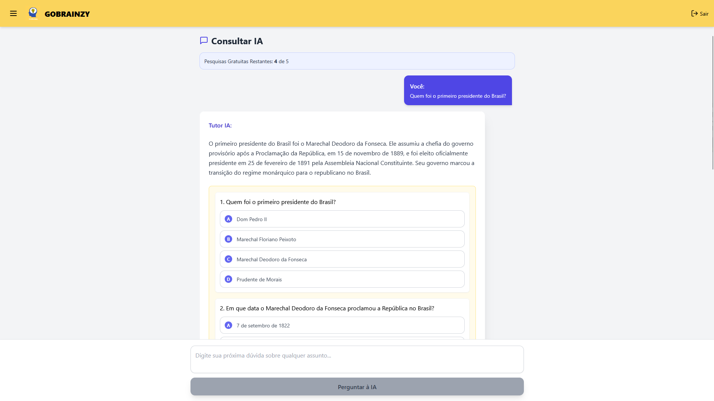

# GOBRAINZY — AI-Powered Study Assistant

GOBRAINZY is a web application that uses Google's Gemini AI to help students learn more effectively. Users can ask questions on any subject and receive structured answers, interactive quizzes, mental maps, and YouTube video suggestions — all in one place.



## Features

- **AI Chat** — Ask any question and get a detailed answer powered by Gemini AI
- **Interactive Quizzes** — Each response includes a multiple-choice quiz to reinforce learning
- **Mental Maps** — Visual concept maps generated for each topic
- **YouTube Suggestions** — Relevant video recommendations surfaced via Google Search grounding
- **Gamification** — Earn points for every interaction and unlock avatar icons
- **Session History** — All conversations are saved and organized by session
- **Freemium Model** — Free tier with limited searches; Premium tier with unlimited access
- **Authentication** — Email/password login and registration via Firebase Auth

## Tech Stack

| Layer | Technology |
|---|---|
| Frontend | React 19, Vite 7 |
| Styling | Tailwind CSS |
| Icons | Lucide React |
| Backend / Auth | Firebase Authentication |
| Database | Firebase Firestore |
| Hosting | Firebase Hosting |
| AI | Google Gemini API (`gemini-2.5-flash-preview-04-17`) |
| Diagrams | ReactFlow |

## Getting Started

### Prerequisites

- Node.js 18+
- A [Firebase](https://firebase.google.com/) project with Authentication and Firestore enabled
- A [Google Gemini API key](https://aistudio.google.com/app/apikey)

### Installation

1. **Clone the repository**
   ```bash
   git clone https://github.com/your-username/gobrainzy.git
   cd gobrainzy
   ```

2. **Install dependencies**
   ```bash
   npm install
   ```

3. **Set up environment variables**

   Create a `.env` file in the root of the project based on `.env.example`:
   ```bash
   cp .env.example .env
   ```

   Fill in your credentials:
   ```
   VITE_FIREBASE_API_KEY=your_firebase_api_key
   VITE_FIREBASE_AUTH_DOMAIN=your_project.firebaseapp.com
   VITE_FIREBASE_PROJECT_ID=your_project_id
   VITE_FIREBASE_STORAGE_BUCKET=your_project.appspot.com
   VITE_FIREBASE_MESSAGING_SENDER_ID=your_sender_id
   VITE_FIREBASE_APP_ID=your_app_id
   VITE_GEMINI_API_KEY=your_gemini_api_key
   ```

4. **Start the development server**
   ```bash
   npm run dev
   ```

   The app will be available at `http://localhost:5173`.

## Available Scripts

| Command | Description |
|---|---|
| `npm run dev` | Start the Vite development server with hot reload |
| `npm run build` | Build the project for production (outputs to `/dist`) |
| `npm run preview` | Preview the production build locally |
| `npm run lint` | Run ESLint across the project |

## Deployment

This project is configured for Firebase Hosting.

1. **Build the project**
   ```bash
   npm run build
   ```

2. **Deploy to Firebase**
   ```bash
   firebase deploy
   ```

Make sure you are logged in to the Firebase CLI (`firebase login`) and have selected the correct project (`firebase use your-project-id`).

## Project Structure

```
gobrainzy/
├── public/              # Static assets (logo, icons)
├── src/
│   ├── assets/          # Images and media used in components
│   ├── App.jsx          # Main application component
│   ├── App.css          # Global component styles
│   ├── MentalMap.jsx    # Mental map visualization component
│   ├── MentalMap.css    # Mental map styles
│   ├── main.jsx         # React entry point
│   └── index.css        # Base styles
├── .env.example         # Environment variable template
├── .gitignore
├── firebase.json        # Firebase Hosting configuration
├── index.html           # HTML entry point
├── package.json
└── vite.config.js       # Vite configuration
```

## Environment Variables

| Variable | Description |
|---|---|
| `VITE_FIREBASE_API_KEY` | Firebase project API key |
| `VITE_FIREBASE_AUTH_DOMAIN` | Firebase Auth domain |
| `VITE_FIREBASE_PROJECT_ID` | Firebase project ID |
| `VITE_FIREBASE_STORAGE_BUCKET` | Firebase Storage bucket |
| `VITE_FIREBASE_MESSAGING_SENDER_ID` | Firebase Messaging sender ID |
| `VITE_FIREBASE_APP_ID` | Firebase App ID |
| `VITE_GEMINI_API_KEY` | Google Gemini API key |

> **Never commit your `.env` file.** It is listed in `.gitignore` by default.

## License

This project is private and not licensed for public distribution.
